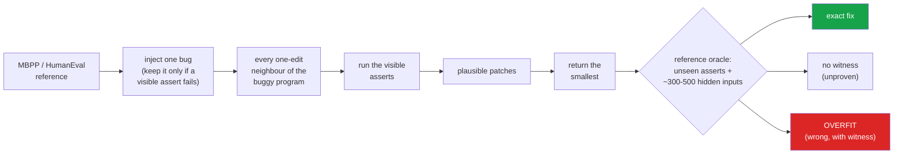

<h1 align="center">minimal-diff (Python · stdlib ast · program repair · Ollama)</h1>
<p align="center"><i>The smallest patch that passes the tests is the right one two times in three - and being small is not why</i></p>

<p align="center">
  <a href="#the-through-line">The through-line</a> &middot;
  <a href="#findings">Findings</a> &middot;
  <a href="#input--output">Input / Output</a> &middot;
  <a href="#the-model-arm-queued">Model arm</a> &middot;
  <a href="#quick-start">Quick start</a> &middot;
  <a href="#what-this-does-not-do">What it does NOT do</a> &middot;
  <a href="#problems-hit-while-building-this">Problems hit</a>
</p>

<p align="center">
  
  
  
  
  <a href="LICENSE"></a>
</p>

---

"The laziest senior dev" writes the fix that changes the least. That is good taste, and it
is also a claim: that among the patches which make the failing test pass, the smallest is
the likeliest to be right. This repo measures it. It injects single-point bugs into MBPP and
HumanEval reference solutions, repairs every one of them with a classical search that
returns the smallest patch the visible tests accept, and checks that patch against the
reference on hundreds of inputs the tests never used - so "passes the tests" and "is
correct" are counted separately, with a witness for every wrong one.

Inspired by [DietrichGebert/ponytail](https://github.com/DietrichGebert/ponytail); no code
from it is used. Mutation operators and the MBPP/HumanEval loaders are adapted from
[hammasbuilds/mbpp-false-accepts](https://github.com/hammasbuilds/mbpp-false-accepts).

## The through-line



The known fix is always one edit away (the repair operators are a superset of the inverse of
every injected mutation - 100% of 6,715 tasks, checked per task), so the search never fails
to *reach* the right answer. The only question is whether the tests and the size preference
*pick* it.

> **They mostly do not need size to pick it, and when they fail, size does not rescue them.
> Almost every plausible patch is a one-token change, the wrong ones as small as the right
> one. What separates them is how many tests the repairer is shown: with one failing assert
> 44% of returned HumanEval patches are provably wrong, with all ~8 asserts 10%.**

## Findings

Every number is from `results/classical_repair.json` (6,715 tasks: 5,548 over 774 MBPP
problems, 1,167 over 151 HumanEval problems). Brackets are 95% cluster-bootstrap intervals
resampling *problems*, because the tasks of one problem share a test suite.

| | Finding | The numbers |
|---|---|---|
| **1** | **MBPP's three asserts: the returned patch is the known fix two times in three, and provably wrong in one task out of six.** | exact **67.1%** [64.8, 69.3] · no witness 14.8% · **overfit 18.0%** [16.2, 19.9] |
| **2** | **Preferring the smallest plausible patch buys nothing - slightly less than nothing.** Returning *any* plausible patch at random overfits less often. With ties broken at random, "smallest" is 0.4 points worse (paired); with ties broken by site order, as the search does, 1.9 points worse. | MBPP overfit: any plausible 16.1% · smallest, random tie 16.5% (paired **+0.39 pp** [+0.15, +0.61]) · smallest, site order 18.0% (paired +1.92 pp [+1.10, +2.74]); HumanEval (all) site order +2.81 pp [+1.28, +4.38] |
| **3** | **Because wrong patches are just as small.** 39% of tasks have a tie at the minimum size; in 28% a provably wrong patch is at least as small as the fix. Mean size of a wrong plausible patch: 1.16 tokens; of the fix: 1.06. | tie at smallest 39.2% · wrong patch ≤ fix 27.5% [25.0, 30.1] |
| **4** | **What does work is more tests.** Same bugs, same search, only the number of visible asserts changes. | HumanEval overfit **43.7% → 23.9% → 10.4%** at 1 → 3 → 8.1 asserts; MBPP 35.6% → 18.0% at 1 → 3 |
| **5** | **Knowing where the bug is helps only when tests are thin.** Restricting the search to the faulty line (an oracle no real tool has) removes a quarter of MBPP's wrong patches, and nothing measurable on HumanEval with its full suite. | MBPP 18.0% → 13.7%, paired reduction **4.4 pp** [3.6, 5.3]; HumanEval (all) 0.3 pp [−0.3, +0.9] |
| **6** | **Comparisons and negated conditions are where repair goes wrong;** operator swaps almost never. | MBPP overfit: `compare` 37.4%, `negate_if` 30.5%, `binop` 7.5%, `boolop` 9.9% |

The hypothesis the repo was built around - "the smallest diff is the right one" - did not
hold for search-based repair. Minimality is saturated: when every candidate is one token,
it cannot rank them, and the ranking that remains (site order) is no better than chance.

### How strong is the oracle?

"Overfit" means a witness exists: an assert the repairer was not shown, one of MBPP's
hidden challenge asserts, or an input on which the patch and the reference disagree. Inputs
come in two sets, each run on the reference first and kept only if it returns a value,
deterministically: *near* inputs (every EvalPlus input for HumanEval, thinned to 150; one-step
perturbations of the asserts' own arguments) and *fuzz* inputs (up to 350 random,
type-preserving mutations of the same arguments). After vetting, an MBPP problem has 292
hidden inputs on average (52 near), a HumanEval problem 486 (211 near); 4 MBPP problems,
whose functions take objects built in setup code, have none and rely on unseen asserts alone.

Of the 1,001 overfit patches MBPP returns with all three asserts shown, 852 were caught by a
near input, **146 only by fuzzing**, 3 by a hidden assert. A tenfold input budget kept finding
wrong programs, so the "no witness" bucket still contains some: **18.0% is a lower bound on
MBPP's overfit rate and 18.0% + 14.8% = 32.9% an upper bound.** Some of the no-witness patches
are genuinely correct, and they are interesting in their own right - 13.1% of the no-witness
patches MBPP returns edit a line that was never broken and compensate for the bug instead
(sample 5 below).

### Controls

- **Random plausible patch**: the expected overfit rate if the search returned any
  plausible patch at all. Finding 2's baseline.
- **Smallest with random tie-break**: separates a size effect from a site-order effect.
- **At-fault oracle**: the smallest patch that edits only the faulty line. Finding 5.
- **Visible-test regimes** `k1` / `k3` / `all`: prefixes of one fixed assert order that
  starts with an assert the bug fails, so every regime has a failing test and each contains
  the last. Finding 4.
- **Isolation check**: 790 sampled candidates re-run each in a brand-new interpreter agree
  with the pooled run 790 of 790 (`results/isolation_check.json`).

## Input / Output

`uv run python demo.py` repairs five real tasks live and prints this (abridged only where
marked).

**1. HumanEval's six asserts pin the fix down: one plausible patch, and it is the fix**

```
task humaneval/52/compare@17  (injected: compare, faulty line [9])
    ...
        for e in l:
            if e > t:
                return False
        return True

visible asserts shown to the repairer (all):
  [   fail] assert not below_threshold([1, 8, 4, 10], 10)
  [   pass] assert below_threshold([1, 2, 4, 10], 100)
  [   pass] assert not below_threshold([1, 20, 4, 10], 5)
  [   pass] assert below_threshold([1, 20, 4, 10], 21)
  [   pass] assert below_threshold([1, 20, 4, 10], 22)
  [   pass] assert below_threshold([1, 8, 4, 10], 11)

6 one-edit candidates, 1 pass every shown assert:
  compare@17:0:GtE   tokens=1 ast=1 at_fault=yes  exact      <- the known fix
      - if e > t:
      + if e >= t:

smallest-first repair returns compare@17:0:GtE: EXACT
```

**2. MBPP's three asserts do not: two one-token patches pass, the wrong one is returned**

```
task mbpp/3/binop@17  (injected: binop, faulty line [5])

buggy program:
    import math

    def is_not_prime(n):
        result = False
        for i in range(2, int(math.sqrt(n)) - 1):
            if n % i == 0:
                result = True
        return result

visible asserts shown to the repairer (all):
  [   fail] assert is_not_prime(10) == True
  [   pass] assert is_not_prime(2) == False
  [   fail] assert is_not_prime(35) == True

24 one-edit candidates, 2 pass every shown assert:
  const@16:-1        tokens=1 ast=1 at_fault=yes  overfit
      - for i in range(2, int(math.sqrt(n)) - 1):
      + for i in range(1, int(math.sqrt(n)) - 1):
      witness: is_not_prime(11): reference False, patch True
  binop@17:Add       tokens=1 ast=1 at_fault=yes  exact      <- the known fix
      - for i in range(2, int(math.sqrt(n)) - 1):
      + for i in range(2, int(math.sqrt(n)) + 1):

smallest-first repair returns const@16:-1: OVERFIT
```

Both patches change one token on the faulty line. Starting the loop at 1 makes every
`n % 1 == 0` true, so every number above 3 is "not prime" - which is exactly what the two
failing asserts wanted.

**3. Shown only the failing assert, five of six plausible patches are wrong or unproven...**

```
task mbpp/53/compare@5  (injected: compare, faulty line [2])

buggy program:
    def check_Equality(str):
        if str[0] != str[-1]:
            return 'Equal'
        else:
            return 'Not Equal'

visible asserts shown to the repairer (k1):
  [   fail] assert check_Equality("abcda") == "Equal"

10 one-edit candidates, 6 pass every shown assert:
  negate_if@4        tokens=1 ast=2 at_fault=yes  no_witness
      - if str[0] != str[-1]:
      + if not str[0] != str[-1]:
  compare@5:0:LtE    tokens=1 ast=1 at_fault=yes  overfit
      - if str[0] != str[-1]:
      + if str[0] <= str[-1]:
      witness: fails `assert check_Equality("ab") == "Not Equal"`
  ... (GtE, str[1], str[-2]: all overfit, same witness style)
  compare@5:0:Eq     tokens=1 ast=1 at_fault=yes  exact      <- the known fix
      - if str[0] != str[-1]:
      + if str[0] == str[-1]:

smallest-first repair returns compare@5:0:LtE: OVERFIT
```

**4. ...shown all three, the fix is the only one left**

```
visible asserts shown to the repairer (all):
  [   fail] assert check_Equality("abcda") == "Equal"
  [   fail] assert check_Equality("ab") == "Not Equal"
  [   fail] assert check_Equality("mad") == "Not Equal"

10 one-edit candidates, 2 pass every shown assert:
  negate_if@4        tokens=1 ast=2 at_fault=yes  no_witness
      - if str[0] != str[-1]:
      + if not str[0] != str[-1]:
  compare@5:0:Eq     tokens=1 ast=1 at_fault=yes  exact      <- the known fix
      - if str[0] != str[-1]:
      + if str[0] == str[-1]:

smallest-first repair returns compare@5:0:Eq: EXACT
```

Here size does break the tie - `not a != b` is two AST nodes to the fix's one - and the
patch it loses to is equivalent anyway.

**5. A patch nothing can tell from the fix - on a line that was never broken**

```
task mbpp/867/negate_if@32  (injected: negate_if, faulty line [6])

buggy program:
    def min_Num(arr, n):
        odd = 0
        for i in range(n):
            if arr[i] % 2:
                odd += 1
        if not odd % 2:
            return 1
        return 2

3 of 32 one-edit candidates pass every shown assert:
  const@8:+1         tokens=1 ast=1 at_fault=no   no_witness
      - odd = 0
      + odd = 1
  const@8:-1         tokens=2 ast=3 at_fault=no   no_witness
      - odd = 0
      + odd = -1
  unnegate_if@32     tokens=1 ast=2 at_fault=yes  exact      <- the known fix
      - if not odd % 2:
      + if odd % 2:

smallest-first repair returns const@8:+1: NO_WITNESS
```

Starting the count at 1 flips its parity, which cancels the injected `not`. The program is
correct on every input - and the diff touches a line nobody broke. By tokens it is exactly as
small as the real fix; by AST nodes it is *smaller*.

## The model arm (queued)

Built, tested with a deterministic fake, not run: the GPU was in use by another job while
this was built. `qwen2.5-coder:14b` repairs one task from each of 200 MBPP and 151 HumanEval
problems (bug kinds balanced, seeded) under three prompts that differ only in the
instruction:

- `plain` - "Fix the bug so that the program is correct."
- `minimal` - "You are the laziest senior developer on the team: the best fix is the one that
  changes the least ... not merely make these tests pass."
- `diff` - the same, but the reply must be a unified diff, applied to the buggy program
  (a diff that does not apply is a failed repair).

Every reply is cached on disk by (model, prompt, options), turned into a program, and scored
by the same oracle and the same four size measures as the search, with the search's result
on the same tasks alongside. 1,053 calls:

```bash
scripts/run_models.sh --dry-run    # job list and call count; touches no model
scripts/run_models.sh              # checks free RAM, free VRAM and ollama, then runs
```

The findings above do not depend on it. What it will add is whether an LLM's patches are
larger than they need to be, whether telling it to be lazy makes them smaller, and whether
smaller LLM patches overfit more or less than the search's.

## Quick start

```bash
git clone https://github.com/hammasbuilds/minimal-diff
cd minimal-diff
uv sync

uv run pytest -q                       # 94 tests, no dataset, no model, ~40 s
uv run python demo.py                  # the five repairs above, live
uv run minimal-diff show mbpp/3/binop@17 --regime k1   # any task, any regime
uv run minimal-diff report             # re-aggregate results/classical_*.jsonl.gz
```

Reproduce everything from the raw datasets (about 1.5 hours on 8 workers):

```bash
uv run minimal-diff build-tasks        # inject bugs, vet hidden inputs -> data/*.jsonl.gz
uv run minimal-diff repair             # resumable; appends to results/classical_*.jsonl.gz
uv run minimal-diff report             # -> results/classical_repair.json
uv run minimal-diff check-isolation    # -> results/isolation_check.json
```

## Layout

```
src/minimal_diff/
  data.py         MBPP / HumanEval / EvalPlus loaders (from data/raw, committed)
  operators.py    bug injection (as mbpp-false-accepts) and the repair neighbourhood
  tasks.py        buggy program + failing assert + fault lines + vetted hidden inputs
  inputs.py       near inputs (perturbed assert arguments) and type-preserving fuzz
  sandbox.py      reusable worker processes, per-item timeouts, a memory cap
  _child.py       the process that runs candidate code; interrupts its own hangs
  oracle.py       exact / no_witness / overfit, with the witness
  diffmetrics.py  lines, tokens, Zhang-Shasha AST distance, unrelated lines
  repair.py       the search and its selection policies
  study.py        run every task (resumable) and aggregate
  stats.py        cluster bootstrap over problems
  isolation.py    pooled vs fresh-interpreter agreement
  cli.py          `minimal-diff` build-tasks | repair | report | show | check-isolation | model
  model/          prompts, Ollama client + disk cache, reply parsing and diff applying, scoring
data/raw/         mbpp.jsonl (CC BY 4.0), humaneval.jsonl (MIT), humanevalplus.jsonl.gz (Apache-2.0)
data/             problems_*.jsonl.gz, tasks_*.jsonl.gz (built by build-tasks)
results/          per-task rows, the summary, the isolation check, build stats
scripts/run_models.sh
demo.py
```

## Requirements

Python 3.11+ and `uv`. Zero runtime dependencies; `pytest` and `ruff` for development. The
model arm needs Ollama with `qwen2.5-coder:14b` (about 11 GB of VRAM at Q4). Developed on
Windows 11; the sandbox caps child memory with a Job Object there and `RLIMIT_AS` elsewhere.

## Tests

```bash
uv run pytest -q     # 94
uv run ruff check src tests
```

Tests build their own programs; `MINIMAL_DIFF_DATA` and `MINIMAL_DIFF_RESULTS` are pointed
at empty directories for every test, so none can read the real datasets or overwrite a
result. They cover the sandbox's failure modes (hang, hang that swallows the interrupt, C-level
sleep, crash, 8 GB allocation, forged output, state leaking between candidates), the premise
that every injected bug is one repair edit from its reference, the tree edit distance against
textbook cases and its shortcut against the full computation, the oracle's three buckets, the
selection policies, the storage round trip, the CLI end to end on a fixture dataset, and the
model arm end to end against a fake client, including a diff with wrong line numbers and a
reply that is not code.

## What this does NOT do

- **It does not repair real bugs.** The bugs are single-point mutations of reference
  solutions. They are realistic in shape (off-by-one comparisons, wrong operators, nudged
  constants, flipped conditions) but not drawn from any bug tracker.
- **It does not search beyond one edit.** The known fix is one edit away by construction, so
  "the search found nothing" never happens and multi-edit repair is not measured.
- **It does not prove correctness.** "No witness" means a few hundred inputs did not
  separate the patch from the reference; it is its own bucket, never counted as correct.
- **It has no model result yet.** The LLM arm is built and queued, not run.
- **It does not sandbox against malice.** Candidates run in a child process with a timeout
  and a memory cap, not in a container. They are mutants of benchmark solutions.

## Problems hit while building this

- **A 0.0% that was a bug.** The first full run said the smallest patch *never* fixed a
  negated condition. The repair operators offered two edits on `if not x:` - remove the
  `not`, or add another - and `not not x` ties with the real fix on every size measure and
  came first in site order. It is a no-op in a condition, so it is no longer generated.
- **Starting Python cost more than the tests.** On this (shared, busy) machine an
  interpreter took 0.6 s to start. One process per job gave 0.2 tasks/s; reusable workers fed
  jobs over stdin brought the whole repair run to about an hour.
- **Hangs dominated what was left.** Mutated loop conditions hang constantly (2.6 timeouts per
  MBPP task). Killing and restarting the worker for each cost about 5 s; the child now interrupts
  its own overrunning item with `PyThreadState_SetAsyncExc` from a watchdog thread, and the
  parent's kill is kept only for code stuck inside one C call. And because the visible-test
  regimes are prefixes of one assert order, a candidate can stop at its first failure without
  losing any regime's verdict - one timeout per hanging candidate instead of three.
- **Results written in order look stalled.** `ThreadPoolExecutor.map` yields in submission
  order, so one slow early task held the output file at 96 rows for minutes while hundreds
  had finished behind it. I stopped a healthy run over it once.
- **Two different candidates had the same name.** Every alternative at one site was labelled
  `compare@40`, so a by-name lookup returned five patches for one. Labels now carry the
  alternative (`compare@40:0:LtE`).
- **Near inputs are not enough.** Fuzzing found 146 more wrong patches on MBPP that one-step
  perturbations had passed as unproven - reported, and the reason the headline overfit rate is
  called a lower bound.

## Keywords

automated program repair &middot; APR &middot; patch overfitting &middot; plausible patches &middot; test-suite adequacy &middot; mutation testing &middot; differential testing &middot; fuzzing &middot; tree edit distance &middot; Zhang-Shasha &middot; MBPP &middot; HumanEval &middot; EvalPlus &middot; code LLM evaluation &middot; minimal diff &middot; reproducible evaluation

## License

MIT
