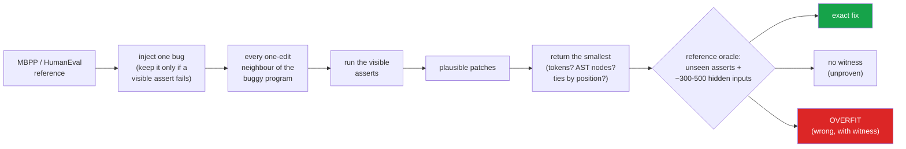

<h1 align="center">minimal-diff (Python · stdlib ast · program repair · Ollama)</h1>
<p align="center"><i>Among one-edit patches that pass the tests, "the smallest" is decided by how you count size and break ties - not by size</i></p>

<p align="center">
  <a href="#the-through-line">The through-line</a> &middot;
  <a href="#findings">Findings</a> &middot;
  <a href="#input--output">Input / Output</a> &middot;
  <a href="#repair-your-own-function">Repair your own function</a> &middot;
  <a href="#the-model-arm-queued">Model arm</a> &middot;
  <a href="#quick-start">Quick start</a> &middot;
  <a href="#what-this-does-not-do">What it does NOT do</a> &middot;
  <a href="#problems-hit-while-building-this">Problems hit</a>
</p>

<p align="center">
  
  
  
  
  <a href="LICENSE"></a>
</p>

---

"The laziest senior dev" writes the fix that changes the least. That is good taste, and it
is also a claim: that among the patches which make the failing test pass, the smallest is
the likeliest to be right. This repo measures it. It injects single-point bugs into MBPP and
HumanEval reference solutions, repairs every one with a classical search over one-edit
changes, and checks the patch it returns against the reference on hundreds of inputs the
tests never used - so "passes the tests" and "is correct" are counted separately, with a
witness for every wrong one.

Inspired by [DietrichGebert/ponytail](https://github.com/DietrichGebert/ponytail); no code
from it is used. Mutation operators and the MBPP/HumanEval loaders are adapted from
[hammasbuilds/mbpp-false-accepts](https://github.com/hammasbuilds/mbpp-false-accepts).
Data licences are in [NOTICE](NOTICE).

## The through-line



The known fix is always one edit away (the repair operators are a superset of the inverse of
every injected mutation - 100% of 6,731 tasks, checked per task), so the search never fails
to *reach* the right answer. The question is whether the tests and a size preference *pick*
it. The scope is deliberately narrow: this is the one-edit space, where 98.4% of MBPP's
12,844 plausible patches change exactly one token and 88.6% exactly one token *and* one AST
node (95.0% and 86.4% if the brackets `ast.unparse` adds are counted as tokens), and where
only 44% of tasks (2,434 of 5,564) have more than one plausible patch for any ranking to
choose between.

> **In that space, size cannot tell right from wrong. Preferring the smaller patch with ties
> broken at random moves MBPP's exact-fix rate by +0.3 points counting tokens and −1.4
> counting tokens then AST nodes; which of those two you count moves "smallest-first" from
> 66.7% to 73.9%. Showing the repairer more tests moves the wrong-patch rate on HumanEval
> from 36.2% to 3.8%.**

## Findings

Every number is from `results/classical_repair.json` (6,731 tasks: 5,564 over 775 MBPP
problems, 1,167 over 151 HumanEval problems). Square brackets are 95% cluster-bootstrap intervals
resampling *problems*, because the tasks of one problem share a test suite. "Paired" means the
two policies are compared task by task and the interval is on the difference.

| | Finding | The numbers (MBPP, all 3 asserts shown, unless noted) |
|---|---|---|
| **1** | **The size metric decides the headline.** "Smallest by tokens" and "smallest by tokens, then AST nodes" are both reasonable readings of "the fix that changes the least". They return different patches on hundreds of tasks. | exact: tokens **73.9%** [71.8, 75.8] vs tokens+AST **66.7%** [64.2, 68.9]; overfit 13.2% vs 17.6% |
| **2** | **Size itself buys almost nothing.** With ties broken at random, preferring the smaller patch over *any* plausible patch changes the exact-fix rate by less than half a point, in a direction that depends on the metric. | vs any plausible (71.0% exact): tokens **+0.30 pp** [+0.20, +0.42]; tokens+AST **−1.35 pp** [−1.58, −1.13]; HumanEval (all) tokens +0.26 pp [+0.11, +0.46] |
| **3** | **Because wrong patches are as small as right ones.** At the smallest token count 43% of tasks have a tie; in 27% a provably wrong patch is at least as small as the fix. The fix is *strictly* the smallest in 57%. | wrong patch ≤ fix 27.3% [24.7, 30.1]; mean size of a wrong plausible patch 1.03 tokens / 1.10 nodes, of the fix 1.01 / 1.12 |
| **4** | **Tie-breaking by position is an artefact, and a large one.** "Smallest by tokens, earliest site" gains 2.9 pp over any plausible patch - but all of it comes from negated conditions, where the fix (the `if` node) precedes every competing edit in the walk. Without them the same policy *loses* 3.1 pp. | tokens + site order vs any: +2.85 pp [+1.98, +3.72]; excluding `negate_if`: **−3.08 pp** [−3.94, −2.21] |
| **5** | **Negated conditions are where the metric bites.** Removing a `not` is one token but two AST nodes, so any AST-aware metric ranks it below every one-node operator swap. | `negate_if` (680 tasks) exact: tokens + site 92.5% · tokens, random tie 47.2% · any plausible 47.1% · **tokens+AST 21.9%** |
| **6** | **What does work is more tests.** Same bugs, same search, only the number of visible asserts changes. | HumanEval overfit (tokens) **36.2% → 15.1% → 3.8%** at 1 → 3 → 8.1 asserts; MBPP 30.7% → 13.2% at 1 → 3 |
| **7** | **Knowing where the bug is helps only when tests are thin.** Restricting the search to the faulty line - an oracle no real tool has - cuts MBPP's wrong patches by about a third and does nothing measurable on HumanEval's full suite. | MBPP 13.2% → 8.4%, paired **4.8 pp** [3.9, 5.7]; HumanEval (all) 0.3 pp [−0.3, +0.9] |

Every metric side by side, MBPP with all three asserts (`minimal-diff report` prints this):

| size metric | exact, ties by site | overfit, ties by site | exact, random ties | overfit, random ties | site order − any plausible, overfit |
|---|---|---|---|---|---|
| tokens | 73.9% | 13.2% | 71.3% | 15.2% | −2.3 pp [−3.1, −1.5] |
| lines | 73.5% | 13.5% | 71.0% | 15.4% | −2.0 pp [−2.7, −1.2] |
| AST nodes | 66.8% | 17.6% | 69.7% | 16.2% | +2.1 pp [+1.4, +2.9] |
| tokens, then AST nodes | 66.7% | 17.6% | 69.7% | 16.2% | +2.2 pp [+1.4, +2.9] |
| AST nodes, then tokens | 66.7% | 17.6% | 69.7% | 16.2% | +2.2 pp [+1.4, +2.9] |
| *tokens, brackets counted (robustness check)* | *73.6%* | *13.2%* | *71.5%* | *15.0%* | *−2.2 pp [−3.0, −1.4]* |
| *no preference (any plausible)* | *71.0%* | *15.4%* | | | |

(Every one-edit patch changes exactly one line, so "lines" with random ties *is* "any
plausible".) An earlier version of this README ranked by tokens then AST nodes, reported that
"smallest" was slightly *worse* than chance, and called that a finding about size. An
independent review showed it was the metric: the conclusion that survives is the one above -
that the ranking is fragile and size carries almost no signal here.

**Counting brackets.** `tokens` does not count a bracket that only groups (one that does not
open a call or a definition's parameters). Those are not edits anyone types: when the search
swaps `*` for `+` in `a + b * c`, `ast.unparse` has to write `a + (b + c)`, and counting the
brackets made that one-operator patch three tokens. A second review caught this. The rule
re-measures 463 of MBPP's 12,844 plausible patches and changes the pick on 119 of 5,564
tasks. The headline barely moves - 73.6% → 73.9% exact and 13.25% → 13.16% overfit, paired
differences +0.25 pp [−0.05, +0.55] and −0.09 pp [−0.36, +0.20] - but finding 2 shrinks:
counting brackets, a size preference looked worth +0.48 pp [+0.31, +0.67], and part of that
was brackets, because the wrong patches carried more of them (mean 1.16 tokens against the
fix's 1.06; without brackets 1.03 against 1.01). Both counts are in the results (`tokens`,
`tokens-raw` and `tokens_vs_tokens_raw`).

Long solutions contribute more mutants, so the tables weight each task equally. Weighting each
*problem* equally instead (`rate_per_problem` in the results) moves MBPP smallest-by-tokens to
79.4% exact and 9.4% overfit, against 76.5% and 11.2% for any plausible patch.

### How strong is the oracle?

"Overfit" means a witness exists: an assert the repairer was not shown, one of MBPP's hidden
challenge asserts, or an input on which the patch and the reference disagree. Inputs come in
two sets: *near* inputs (every EvalPlus input for HumanEval, thinned to 150; one-step
perturbations of the asserts' own arguments) and *fuzz* inputs (up to 350 random,
type-preserving mutations of the same arguments). Arguments are evaluated in the program's own
namespace, so an input may build a class the solution defines or use an object its setup
built. After vetting, an MBPP problem has 292 hidden inputs on average (52.5 near), a HumanEval
problem 483 (209 near); none has zero.

Every judgement uses one per-problem time budget: at least 1 s per assert or input, and never
under 20 times the reference's slowest assert. A hidden input is kept only if a whole
comparison of the reference *against itself* on it - both calls and the equality check - takes
at most 0.05 s. Any witness that is a timeout is re-run at ten times the budget before it is
accepted (`hang`); a patch that kills the interpreter is recorded as `crash`, separately.

Two self-checks, both in `results/`:

- **No false witnesses** (`oracle_check.json`): each of the 926 references, plus one inert
  statement so it is not the reference text, judged by the full oracle: **0** called overfit.
- **Worker reuse changes nothing** (`isolation_check.json`): 797 sampled candidates re-run each
  in a brand-new interpreter agree with the pooled run 797 of 797.

Of the 732 overfit patches smallest-by-tokens returns on MBPP with all asserts shown, 641 were
caught by a near input, **82 only by fuzzing**, 7 by hanging and 2 by a hidden assert. More
inputs kept finding wrong programs, so the "no witness" bucket still holds some: **13.2% is a
lower bound on MBPP's overfit rate and 13.2% + 13.0% = 26.2% an upper bound.** Some no-witness
patches are genuinely correct and interesting in their own right: 15.1% of the ones MBPP
returns edit a line that was never broken and compensate for the bug instead (sample 5).

### Controls

- **Any plausible patch**: the expected result if the search returned any plausible patch at
  all. The no-preference baseline for findings 2 and 4.
- **Random tie-break**: separates a size effect from a site-order effect (finding 4).
- **Five size metrics**: tokens, AST nodes, lines, and both lexicographic combinations
  (finding 1), plus tokens with grouping brackets counted, as a robustness check.
- **At-fault oracle**: the smallest patch that edits only the faulty line (finding 7).
- **Visible-test regimes** `k1` / `k3` / `all`: prefixes of one fixed assert order that
  starts with an assert the bug fails, so every regime has a failing test and each contains
  the last (finding 6).

### Where this sits

None of this contradicts the automated program repair literature; it measures one knob in
it. Search-based repair over operator swaps and constant nudges is the PraPR family (Ghanbari
et al., 2019). That a patch passing the tests is often not correct is the patch-overfitting
problem: Qi et al. (2015) showed Kali, which only deletes code, produced as many plausible
patches as GenProg on its benchmark, and Smith et al. (2015, "Is the cure worse than the
disease?") measured overfitting against held-out tests and tied it to the strength of the
suite used for repair - which finding 6 reproduces. What this repo adds is narrower: on
benchmark-derived single-point bugs, with a known fix and a differential oracle, "prefer the
smallest diff" is not a usable ranking in the one-edit space, and how "smallest" is counted
changes the answer more than size does.

## Input / Output

`uv run python demo.py` repairs six real tasks live, then runs `fix` on a small file, and
prints what is quoted below verbatim; the one cut is marked in square brackets. Samples
1-6 end with what "smallest" returns under two size metrics.

**1. HumanEval's six asserts pin the fix down: one plausible patch, and it is the fix**

```
task humaneval/52/compare@17  (injected: compare, faulty line [9])

buggy program:
    def below_threshold(l: list, t: int):
        """Return True if all numbers in the list l are below threshold t.
        >>> below_threshold([1, 2, 4, 10], 100)
        True
        >>> below_threshold([1, 20, 4, 10], 5)
        False
        """
        for e in l:
            if e > t:
                return False
        return True

visible asserts shown to the repairer (all):
  [   fail] assert not below_threshold([1, 8, 4, 10], 10)
  [   pass] assert below_threshold([1, 2, 4, 10], 100)
  [   pass] assert not below_threshold([1, 20, 4, 10], 5)
  [   pass] assert below_threshold([1, 20, 4, 10], 21)
  [   pass] assert below_threshold([1, 20, 4, 10], 22)
  [   pass] assert below_threshold([1, 8, 4, 10], 11)

6 one-edit candidates, 1 pass every shown assert:
  compare@17:0:GtE   tokens=1 ast=1 at_fault=yes  exact      <- the known fix
      - if e > t:
      + if e >= t:

smallest by tokens     (ties by site order) returns compare@17:0:GtE: EXACT
smallest by tokens+ast (ties by site order) returns compare@17:0:GtE: EXACT
```

**2. MBPP's three asserts do not: two one-token patches pass, the wrong one is returned**

```
task mbpp/3/binop@17  (injected: binop, faulty line [5])

buggy program:
    import math

    def is_not_prime(n):
        result = False
        for i in range(2, int(math.sqrt(n)) - 1):
            if n % i == 0:
                result = True
        return result

visible asserts shown to the repairer (all):
  [   fail] assert is_not_prime(10) == True
  [   pass] assert is_not_prime(2) == False
  [   fail] assert is_not_prime(35) == True

24 one-edit candidates, 2 pass every shown assert:
  const@16:-1        tokens=1 ast=1 at_fault=yes  overfit
      - for i in range(2, int(math.sqrt(n)) - 1):
      + for i in range(1, int(math.sqrt(n)) - 1):
      witness: is_not_prime(11): reference False, patch True
  binop@17:Add       tokens=1 ast=1 at_fault=yes  exact      <- the known fix
      - for i in range(2, int(math.sqrt(n)) - 1):
      + for i in range(2, int(math.sqrt(n)) + 1):

smallest by tokens     (ties by site order) returns const@16:-1: OVERFIT
smallest by tokens+ast (ties by site order) returns const@16:-1: OVERFIT
```

Both patches change one token and one AST node on the faulty line, so every metric ties
them and site order decides. Starting the loop at 1 makes every `n % 1 == 0` true, so every
number above 3 is "not prime" - exactly what the two failing asserts wanted.

**3. Shown only the failing assert, six one-token patches pass and four are wrong...**

```
task mbpp/53/compare@5  (injected: compare, faulty line [2])

buggy program:
    def check_Equality(str):
        if str[0] != str[-1]:
            return 'Equal'
        else:
            return 'Not Equal'

visible asserts shown to the repairer (k1):
  [   fail] assert check_Equality("abcda") == "Equal"

10 one-edit candidates, 6 pass every shown assert:
  negate_if@4        tokens=1 ast=2 at_fault=yes  no_witness
      - if str[0] != str[-1]:
      + if not str[0] != str[-1]:
  compare@5:0:LtE    tokens=1 ast=1 at_fault=yes  overfit
      - if str[0] != str[-1]:
      + if str[0] <= str[-1]:
      witness: fails `assert check_Equality("ab") == "Not Equal"`
  compare@5:0:GtE    tokens=1 ast=1 at_fault=yes  overfit
      - if str[0] != str[-1]:
      + if str[0] >= str[-1]:
      witness: fails `assert check_Equality("mad") == "Not Equal"`
  compare@5:0:Eq     tokens=1 ast=1 at_fault=yes  exact      <- the known fix
      - if str[0] != str[-1]:
      + if str[0] == str[-1]:
  const@9:+1         tokens=1 ast=1 at_fault=yes  overfit
      - if str[0] != str[-1]:
      + if str[1] != str[-1]:
      witness: fails `assert check_Equality("mad") == "Not Equal"`
  const@17:+1        tokens=1 ast=1 at_fault=yes  overfit
      - if str[0] != str[-1]:
      + if str[0] != str[-2]:
      witness: fails `assert check_Equality("mad") == "Not Equal"`

smallest by tokens     (ties by site order) returns negate_if@4: NO_WITNESS
smallest by tokens+ast (ties by site order) returns compare@5:0:LtE: OVERFIT
```

**4. ...shown all three, two are left: the fix, and an equivalent double negative**

```
[task header and buggy program: the same as sample 3, cut]

visible asserts shown to the repairer (all):
  [   fail] assert check_Equality("abcda") == "Equal"
  [   fail] assert check_Equality("ab") == "Not Equal"
  [   fail] assert check_Equality("mad") == "Not Equal"

10 one-edit candidates, 2 pass every shown assert:
  negate_if@4        tokens=1 ast=2 at_fault=yes  no_witness
      - if str[0] != str[-1]:
      + if not str[0] != str[-1]:
  compare@5:0:Eq     tokens=1 ast=1 at_fault=yes  exact      <- the known fix
      - if str[0] != str[-1]:
      + if str[0] == str[-1]:

smallest by tokens     (ties by site order) returns negate_if@4: NO_WITNESS
smallest by tokens+ast (ties by site order) returns compare@5:0:Eq: EXACT
```

Counting tokens, the two tie and position picks `not a != b`, which is correct but not the
fix; counting AST nodes, the fix wins. With one assert (sample 3) the same AST preference
picked a wrong patch. Neither metric is right on both.

**5. A patch nothing can tell from the fix - on a line that was never broken**

```
task mbpp/867/negate_if@32  (injected: negate_if, faulty line [6])

buggy program:
    def min_Num(arr, n):
        odd = 0
        for i in range(n):
            if arr[i] % 2:
                odd += 1
        if not odd % 2:
            return 1
        return 2

visible asserts shown to the repairer (all):
  [   fail] assert min_Num([1,2,3,4,5,6,7,8,9],9) == 1
  [   fail] assert min_Num([1,2,3,4,5,6,7,8],8) == 2
  [   fail] assert min_Num([1,2,3],3) == 2

32 one-edit candidates, 3 pass every shown assert:
  const@8:+1         tokens=1 ast=1 at_fault=no   no_witness
      - odd = 0
      + odd = 1
  const@8:-1         tokens=2 ast=3 at_fault=no   no_witness
      - odd = 0
      + odd = -1
  unnegate_if@32     tokens=1 ast=2 at_fault=yes  exact      <- the known fix
      - if not odd % 2:
      + if odd % 2:

smallest by tokens     (ties by site order) returns const@8:+1: NO_WITNESS
smallest by tokens+ast (ties by site order) returns const@8:+1: NO_WITNESS
```

Starting the count at 1 flips its parity, which cancels the injected `not`. The program is
correct on every input - and the diff touches a line nobody broke. By tokens it is exactly as
small as the real fix; by AST nodes it is *smaller*.

**6. How size is counted decides it: tied by tokens, the wrong patch wins by AST nodes**

```
task mbpp/167/negate_if@8  (injected: negate_if, faulty line [3])

buggy program:
    def next_Power_Of_2(n):
        count = 0
        if not (n and (not n & n - 1)):
            return n
        while n != 0:
            n >>= 1
            count += 1
        return 1 << count

visible asserts shown to the repairer (all):
  [   fail] assert next_Power_Of_2(0) == 1
  [   fail] assert next_Power_Of_2(5) == 8
  [   fail] assert next_Power_Of_2(17) == 32

34 one-edit candidates, 2 pass every shown assert:
  unnegate_if@8      tokens=1 ast=2 at_fault=yes  exact      <- the known fix
      - if not (n and (not n & n - 1)):
      + if n and (not n & n - 1):
  boolop@11:Or       tokens=1 ast=1 at_fault=yes  overfit
      - if not (n and (not n & n - 1)):
      + if not (n or not n & n - 1):
      witness: next_Power_Of_2(1): reference 1, patch 2

smallest by tokens     (ties by site order) returns unnegate_if@8: EXACT
smallest by tokens+ast (ties by site order) returns boolop@11:Or: OVERFIT
```

Both patches change one token: the fix drops the `not`, the wrong patch swaps `and` for
`or`, and the brackets that come and go with them only group, so they are not counted
(counting them, both are three). By AST nodes the swap is one relabel and the fix is two
deletions, so the AST-aware ranking returns the wrong program; the token ranking returns the
fix only because the `if` comes first in the walk. This is finding 5 in one task.

**7. Your own file: the same search, and a diff that applies to it**

```
$ minimal-diff fix shapes.py --assert "assert perimeter(2, 3) == 10" --assert "assert perimeter(1, 1) == 4"
1 of 20 one-edit changes pass every assert (1 tied at the smallest size by tokens).
Passing the asserts is not the same as being correct: with no reference to check against, only more tests can tell these apart.

  binop@22:Add         tokens=1 ast=1 lines=1
      - return 2 * (w - h)   # the bug: should be +
      + return 2 * (w + h)   # the bug: should be +

smallest by tokens (ties by position): binop@22:Add

--- a/shapes.py
+++ b/shapes.py
@@ -6,4 +6,4 @@
 
 
 def perimeter(w,h):
-    return 2 * (w - h)   # the bug: should be +
+    return 2 * (w + h)   # the bug: should be +
```

Only the edited span changes: the docstring, the comments and the unusual spacing in
`perimeter(w,h)` survive, and the hunk carries the file's real line numbers, so the diff
applies with `git apply` or `patch -p1` (the tests apply it both ways). With one plausible
patch there is nothing to rank; the warning about correctness still stands.

## Repair your own function

```bash
uv run minimal-diff fix buggy.py --tests test_buggy.py        # top-level asserts in a file
uv run minimal-diff fix buggy.py --assert "assert area(2, 3) == 6" --assert "assert area(4, 5) == 20"
uv run minimal-diff fix buggy.py --tests t.py --metric tokens+ast --top 10
uv run minimal-diff fix buggy.py --tests t.py --diff | git apply   # apply the smallest patch
```

It runs the same one-edit search against your asserts and lists every patch that passes them,
smallest first, with a unified diff of the first (sample 7). There is no reference here, so it
says how many patches tied and that passing is not correctness - which, per the findings, is
the part to take seriously.

- **Your file, not a reformatted copy.** Each candidate rewrites only the span of the node it
  edits, so comments, blank lines, line endings and formatting survive, and the diff applies
  with `git apply` or `patch -p1` from the file's folder.
- **Modules next to the file import.** The program's folder is on `sys.path` while it runs, so
  `import helper` works; the folder and anything imported from it are forgotten afterwards.
- **Broken tests are refused, not searched.** An `--assert` that is not exactly one `assert`
  statement (`f(2) == 4` would run, do nothing and "pass") is rejected. If every assert errors
  on the unedited program with a `NameError`, `ImportError` or `SyntaxError` - a misspelt
  function name - it prints each error and stops. An error the bug itself causes (`IndexError`)
  is printed and then repaired like a failure.
- **Asserts it does not run are named.** Only top-level asserts in `--tests` run; any inside a
  function or class is reported with its line number.
- **Exit status** 0 when a patch passes (or nothing needed fixing), 1 when no one-edit patch
  passes, 2 on bad input.

## The model arm (queued)

Built, tested with a deterministic fake, not run: the GPU was in use by another job while
this was built. `qwen2.5-coder:14b` repairs one task from each of 200 MBPP and 151 HumanEval
problems (bug kinds balanced, seeded) under three prompts that differ only in the
instruction:

- `plain` - "Fix the bug so that the program is correct."
- `minimal` - "You are the laziest senior developer on the team: the best fix is the one that
  changes the least ... not merely make these tests pass."
- `diff` - the same, but the reply must be a unified diff, applied to the buggy program
  (a diff that does not apply is a failed repair).

Every reply is cached on disk by (model, prompt, options) together with Ollama's
`done_reason`, turned into a program, and scored by the same oracle, the same per-problem
time budget and the same size measures as the search, with the search's result on the same
tasks alongside. Up to 4,096 new tokens are allowed; a reply that still hits the limit is
counted as `truncated`, not as a failed repair. Rows are appended as they are scored, so a
killed run resumes, and dropped connections, 5xx replies and replies without a message are
retried three times. 1,053 calls, listed task by task in
`results/model_plan_qwen2.5-coder_14b.json`:

```bash
scripts/run_models.sh --dry-run    # job list and call count; touches no model
scripts/run_models.sh              # checks free RAM, free VRAM and ollama, then runs
```

The findings above do not depend on it. What it will add is whether an LLM's patches are
larger than they need to be, whether telling it to be lazy makes them smaller, and whether
smaller LLM patches overfit more or less than the search's.

## Quick start

```bash
git clone https://github.com/hammasbuilds/minimal-diff
cd minimal-diff
uv sync

uv run pytest -q                       # 149 tests, no dataset, no model, ~2 min
uv run python demo.py                  # the seven samples above, live
uv run minimal-diff show mbpp/3/binop@17 --regime k1   # any task, any regime
uv run minimal-diff report             # re-aggregate results/classical_*.jsonl.gz
```

Reproduce everything from the raw datasets (about 1.5 hours on 8 workers):

```bash
uv run minimal-diff build-tasks        # inject bugs, vet hidden inputs -> data/*.jsonl.gz
uv run minimal-diff repair             # resumable; appends to results/classical_*.jsonl.gz
uv run minimal-diff report             # -> results/classical_repair.json
uv run minimal-diff check-isolation    # -> results/isolation_check.json
uv run minimal-diff check-oracle       # -> results/oracle_check.json
```

After a change to the size measures alone, `uv run minimal-diff rescore` re-measures every
patch in `results/classical_*.jsonl.gz` from the task files - no candidate is re-run, and a
test checks it writes exactly the row `repair` would - in about ten minutes instead of an hour.

## Layout

```
src/minimal_diff/
  data.py         MBPP / HumanEval / EvalPlus loaders (from data/raw, committed)
  operators.py    bug injection (as mbpp-false-accepts) and the repair neighbourhood
  tasks.py        buggy program + failing assert + fault lines + vetted hidden inputs
  inputs.py       near inputs (perturbed assert arguments) and type-preserving fuzz
  sandbox.py      reusable worker processes, per-item timeouts, a memory cap
  _child.py       the process that runs candidate code; interrupts its own hangs
  oracle.py       exact / no_witness / overfit, with the witness
  diffmetrics.py  lines, tokens (grouping brackets aside), Zhang-Shasha AST distance, unrelated lines
  repair.py       the search, the size metrics, the selection policies, rescoring
  userfix.py      `minimal-diff fix`: the search on your own file and asserts
  study.py        run every task (resumable) and aggregate
  stats.py        cluster bootstrap over problems
  isolation.py    self-checks: pooled vs fresh interpreter, oracle false positives
  cli.py          `minimal-diff` build-tasks | repair | rescore | report | show | fix | check-* | model
  model/          prompts, Ollama client + disk cache, reply parsing and diff applying, scoring
data/raw/         mbpp.jsonl (CC BY 4.0), humaneval.jsonl (MIT), humanevalplus.jsonl.gz (Apache-2.0)
data/licenses/    the three data licences in full; NOTICE says what came from where
data/             problems_*.jsonl.gz, tasks_*.jsonl.gz (built by build-tasks)
results/          per-task rows, the summary, both self-checks, build stats, model plan
scripts/run_models.sh
.github/workflows/ci.yml   ruff, mypy and pytest on Linux and Windows
demo.py
```

## Requirements

Python 3.11+ and `uv`. Zero runtime dependencies; `pytest`, `ruff` and `mypy` for development. The
model arm needs Ollama with `qwen2.5-coder:14b` (about 11 GB of VRAM at Q4). Developed on
Windows 11; the sandbox caps child memory with a Job Object there and `RLIMIT_AS` elsewhere.

## Tests

```bash
uv run pytest -q     # 149
uv run ruff check src tests demo.py
uv run mypy          # src, clean
```

Tests build their own programs; `MINIMAL_DIFF_DATA` and `MINIMAL_DIFF_RESULTS` are pointed
at empty directories for every test, so none can read the real datasets or overwrite a
result. They cover the sandbox's failure modes (hang, hang that swallows the interrupt, C-level
sleep, crash, 8 GB allocation, forged output, state leaking between candidates), the premise
that every injected bug is one repair edit from its reference, the tree edit distance against
textbook cases and its shortcut against the full computation, the oracle's three buckets
(and that a slow-but-correct patch is not a hang, a crash is not a hang, and a program's own
classes compare by value), every size metric including the un-negation case, the selection
policies, grouping brackets against call brackets, rescoring against a fresh repair, the
`fix` command (its diff applied with `git apply` and `patch` to a commented file, a CRLF file
without a final newline, a neighbouring module imported, non-assert arguments, unrunnable
asserts, nested asserts, bad timeouts), help on every flag, the storage round trip, the CLI end to end on a fixture dataset, and the
model arm end to end against a fake client and a scripted local HTTP server - a diff with
wrong line numbers, a reply that is not code, a truncated reply, 5xx and message-less
replies retried, and a run killed mid-write resuming without losing a row.

## What this does NOT do

- **It does not repair real bugs.** The bugs are single-point mutations of reference
  solutions. They are realistic in shape (off-by-one comparisons, wrong operators, nudged
  constants, flipped conditions) but not drawn from any bug tracker.
- **It does not search beyond one edit.** The known fix is one edit away by construction, so
  "the search found nothing" never happens and multi-edit repair is not measured. The
  findings about size are about this space, where nearly every patch is one token; they do
  not say minimality is useless where patch sizes actually vary.
- **It does not prove correctness.** "No witness" means a few hundred inputs did not
  separate the patch from the reference; it is its own bucket, never counted as correct.
- **It has no model result yet.** The LLM arm is built and queued, not run.
- **It does not sandbox against malice.** Candidates run in a child process with a timeout
  and a memory cap, not in a container. They are mutants of benchmark solutions.

## Problems hit while building this

- **A 0.0% that was a bug.** The first full run said the smallest patch *never* fixed a
  negated condition. The repair operators offered two edits on `if not x:` - remove the
  `not`, or add another - and `not not x` ties with the real fix on every size measure and
  came first in site order. It is a no-op in a condition, so it is no longer generated.
- **Starting Python cost more than the tests.** On this shared, busy Windows machine an
  interpreter took longer to start than a task's tests took to run, and one process per job
  repaired a few tasks a minute. Reusable workers fed jobs over stdin brought the whole
  repair run to about an hour.
- **Hangs dominated what was left.** Mutated loop conditions hang constantly (2.6 timeouts per
  MBPP task). Killing and restarting the worker for each cost a timeout plus a restart; the
  child now interrupts its own overrunning item with `PyThreadState_SetAsyncExc` from a
  watchdog thread, and the parent's kill is kept only for code stuck inside one C call. And because the visible-test
  regimes are prefixes of one assert order, a candidate can stop at its first failure without
  losing any regime's verdict - one timeout per hanging candidate instead of three.
- **Results written in order look stalled.** `ThreadPoolExecutor.map` yields in submission
  order, so one slow early task held the output file still for minutes while hundreds had
  finished behind it. I stopped a healthy run over it once.
- **Two different candidates had the same name.** Every alternative at one site was labelled
  `compare@40`, so a by-name lookup returned five patches for one. Labels now carry the
  alternative (`compare@40:0:LtE`).
- **Near inputs are not enough.** Fuzzing found 82 more wrong patches on MBPP that one-step
  perturbations had passed as unproven - reported, and the reason the headline overfit rate is
  called a lower bound.
- **The oracle was calling `int`.** The entry point was read off the first call in the first
  assert, as in mbpp-false-accepts; for `assert int(lobb_num(5, 3)) == 35` that is `int`, so
  every hidden input of that problem was discarded. It is now the first called name the
  solution defines. Hidden inputs were also evaluated in an empty namespace, which dropped
  every input that builds a solution-defined object (`Pair(5, 24)`) or uses one built in
  setup (`root`); four MBPP problems had no hidden inputs at all until both were fixed.
- **Verdicts that depended on the machine's load.** Between two full runs, 39 MBPP verdicts
  flipped in problems the code change between them did not touch. The culprits were
  exponential references - binomial coefficients by plain
  recursion, every permutation of a seven-letter string - whose hidden inputs took most of
  the time budget, so a correct patch was "overfit by timeout" on one run and not the next.
  Inputs are now kept only if the reference answers them in under 0.05 s, and a timeout is
  reported as its own kind of witness.
- **A size metric I did not question.** The first ranking was tokens then AST nodes, and
  the README said smallest-first was "slightly worse than chance". Review found why:
  removing a `not` is two AST nodes, so every negated-condition task lost its fix to a
  one-node swap. The metric is now a parameter, all five are reported, and the finding is
  the sensitivity itself.
- **Brackets nobody typed.** A second review found the token count charging an operator
  swap for the brackets `ast.unparse` must add to keep the tree (`a + (b + c)`), and wrong
  patches carried more of them than fixes. Grouping brackets no longer count; the old count
  stays in the results as a robustness check, and it had been inflating finding 2.
- **`fix` handed back a reformatted file.** Its first version compared `ast.unparse` forms, as
  the study does, so its diff dropped every comment and had line numbers of a file nobody
  had. It now splices each edit into the original text. It also searched happily when the
  asserts could never run (a misspelt name) and reported "no one-edit fix" - true, and
  useless.
- **"Certainly wrong" that was not.** The first speed vetting timed the reference call
  alone. For `generate_matrix(793)` (MBPP 834) building the matrix is fast but comparing it
  to itself took over a second, so three correct patches were labelled overfit by timeout,
  two of them returned by the search. Vetting now times the whole comparison, every
  timeout witness is re-run at ten times the budget, and `check-oracle` judges every
  reference against itself to prove no false witness remains. A crashed interpreter had
  also been labelled a hang; it is now `crash`.
- **Objects the program defines never compared equal.** The reference and the patch run in
  separate namespaces, and even within one, instances of a class without `__eq__` compare
  by identity - so every hidden input whose answer is such an object was dropped at
  vetting. They are now compared by class name and attributes.

## Keywords

automated program repair &middot; APR &middot; patch overfitting &middot; plausible patches &middot; test-suite adequacy &middot; mutation testing &middot; differential testing &middot; fuzzing &middot; tree edit distance &middot; Zhang-Shasha &middot; MBPP &middot; HumanEval &middot; EvalPlus &middot; code LLM evaluation &middot; minimal diff &middot; reproducible evaluation

## License

MIT
